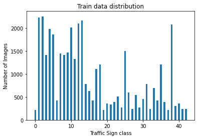

### GTSRB
Keras CNN model to classify traffic signs using [GTSRB](https://www.kaggle.com/datasets/meowmeowmeowmeowmeow/gtsrb-german-traffic-sign). The German Traffic Sign Recognition Benchmark (GTSRB) is a challenging computer vision problem as it has road signs with different shapes, sizes, and colors, it has 43 different traffic signs to classify with more than 50,000 images in total, we will attempt to classify all different 43 road signs to its 35 superclasses with high accuracy, preventing the underfitting and overfitting of the model to our dataset, and minimizing the overall loss.

The traffic signs range in size from 15×15 to 222×192 pixels.

For training, validation, and test we will divide the entire GTSRB dataset into three mutually distinct subsets. The data is partitioned into three sets of 50%, 25% , and 25%.

### Previous work
This dataset was introduced in 2011 and since then numerous papers have been introduced for this problem. Among techniques like K-NNs [1], random forests [2] and embedding learning [3] Convolutional Neural Networks came out with the best accuracies [4].

One such example is the coarse-to-fine hierarchical CNN approach used by Xuehong Mao et al.[5] in which the traffic signs are first composed into super classes and the classification is seen as a hierarchical process. These superclasses are not based on the human-defined subset provided with the dataset, but a CNN-oriented clustering algorithm is used to create K families according to its own criterion. After this, K CNNs each dedicated to one family of images is trained specifically on images from that family of signs. This way, largely similar signs are trained together and the dedicated CNNs have to only focus on the minor differences, giving a more accurate result. The final accuracy for this model was 99.67% Correct detection rate (CDR).

Ameur Zaibi et al used a similar approach. The purpose of their research was to create a CNN model that is lightweight, easy to use in an embedded application, and has high classification accuracy. For the classification of traffic signs, they chose to use an enhanced network LeNet-5 model. They used the same German Traffic Sign Recognition Benchmark (GTSRB) database and also the Belgian Traffic Sign Data Set (BTSD) to train their model network, and it performed well when compared to other models they evaluated and others tested by other researchers.
On GTSRB, they achieved an accuracy of 99.84 percent, while on BTSD, it was 98.37 percent. They decided to test their model for an embedded application using a webcam because of its lightness and low number of parameters (0.38 million) based on the enhanced LeNet-5 network. The findings obtained were efficient, demonstrating the method's efficiency[7].

### Our model
The following procedure is followed:

1. All images are read and resized to 40x40 for consistency.
2. The test and train datasets are visualized according the labels and their frequencies.

39,209 training images and 6315 test images

3. Using Keras to construct a convolutional neural network model. 

4. Used batch size 16, learning rate 0.0001, results for 20 epochs shown.

Maximum accuracy 93.6 %.
